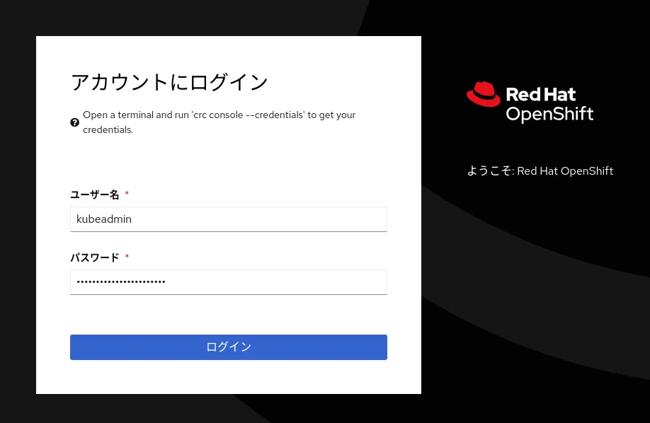

== Webコンソールの使い方

=== Webコンソールの起動

*crc console* コマンドによって、Webブラウザーが起動し、OpenShift Webコンソールが開きます。

[source,bash]
----
$ crc console
Opening the OpenShift Web Console in the default browser...
既存のブラウザ セッションで開いています。
----

=== Webコンソールに管理者としてログイン

管理コンソールにkubeadminというユーザー名でログインしてみましょう。kubadminのパスワードは、oc startコマンドの完了時に表示されたものを使います。

.Webコンソールログイン

[CAUTION]
====
OpenShift Container Platformインストーラーは、kubeadminという初期管理者アカウントを作成します。OpenShift Localもこの点では同じです。このkubeadminというアカウントはcluster-adminというクラスターの全権限をもったアカウントです。kubeadminは一時的なアカウントです。普通の運用では、インストール後にkubeadminを使って本当の管理者アカウントを作成し、管理作業はそのアカウントで実施するようにします。kubeadminは本当の管理者アカウントを作成したあとは削除します。
====

ログインが成功するとOpenShiftの管理コンソールが開きます。OpenShift Localではモニタリングの機能が含まれていないので、CPU使用率のようなリソースの使用状況のグラフやアラート機能は使用できません。

.Webコンソールホーム
image::./images/chap6_console_home.png[]

[TIP]
====
OpenShift Localのモニタリング機能を有効にするには、 $ crc config set enable-cluster-monitoring true を設定します。
====

=== Webコンソールに開発者としてログイン

OpenShift
Localに管理者としてログインするには、developerというユーザー名でログインします。パスワードもdeveloperです。

