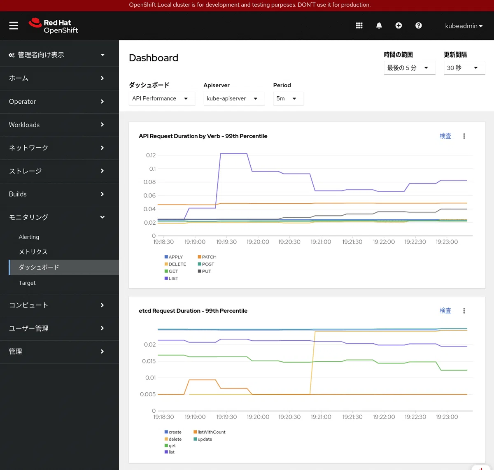

== 管理者向け機能確認

ここはOpenShift Localの内部に興味の管理者の方のみ読んでください。以下のコマンドはkubeadminでログインが必要になります。

=== Clusterversionを調べる

*oc get clusterversion* コマンドでOpenShiftのバージョンを調べることができます。

[source,bash]
----
$ oc get clusterversion
NAME      VERSION   AVAILABLE   PROGRESSING   SINCE   STATUS
version   4.17.1    True        False         26d     Cluster version is 4.17.1
----

=== Cluster Operatorを調べる

OpenShiftの内部サービスは、Cluster Operatorと呼ばれるもので管理されています。 *oc get co* コマンドを実行すると、各Operatorのバージョンや状態がわかります。AVAILABLEの列がすべてTrueになっていることを確認します。

[source,bash]
----
$ oc get co
NAME                                       VERSION   AVAILABLE   PROGRESSING   DEGRADED   SINCE   MESSAGE
authentication                             4.17.1    True        False         False      13m
config-operator                            4.17.1    True        False         False      26d
console                                    4.17.1    True        False         False      13m
control-plane-machine-set                  4.17.1    True        False         False      26d
dns                                        4.17.1    True        False         False      13m
etcd                                       4.17.1    True        False         False      26d
image-registry                             4.17.1    True        False         False      32m
ingress                                    4.17.1    True        False         False      26d
kube-apiserver                             4.17.1    True        False         False      26d
kube-controller-manager                    4.17.1    True        False         False      26d
kube-scheduler                             4.17.1    True        False         False      26d
kube-storage-version-migrator              4.17.1    True        False         False      32m
machine-api                                4.17.1    True        False         False      26d
machine-approver                           4.17.1    True        False         False      26d
machine-config                             4.17.1    True        False         False      26d
marketplace                                4.17.1    True        False         False      26d
network                                    4.17.1    True        False         False      26d
openshift-apiserver                        4.17.1    True        False         False      13m
openshift-controller-manager               4.17.1    True        False         False      13m
openshift-samples                          4.17.1    True        False         False      26d
operator-lifecycle-manager                 4.17.1    True        False         False      26d
operator-lifecycle-manager-catalog         4.17.1    True        False         False      26d
operator-lifecycle-manager-packageserver   4.17.1    True        False         False      14m
service-ca                                 4.17.1    True        False         False      26d
----

=== Nodeの状態を調べる

*oc get node* コマンドで、OpenShift
Localはシングルノードであること、ステータスがReadyであることを確認します。

[source,bash]
----
$ oc get node
NAME   STATUS   ROLES                         AGE   VERSION
crc    Ready    control-plane,master,worker   26d   v1.30.4
----

*oc get adm node-logs* コマンドでノードのログを見ることができます。ここではkubeletのログを覗いてみます。

[source,bash]
----
$ oc adm node-logs crc --unit kubelet | tail -5
Nov 16 10:02:39.473751 crc kubenswrapper[4221]: I1116 10:02:39.473438    4221 kubelet_getters.go:218] "Pod status updated" pod="openshift-etcd/etcd-crc" status="Running"
Nov 16 10:02:39.474409 crc kubenswrapper[4221]: I1116 10:02:39.473786    4221 kubelet_getters.go:218] "Pod status updated" pod="openshift-kube-controller-manager/kube-controller-manager-crc" status="Running"
Nov 16 10:02:39.474409 crc kubenswrapper[4221]: I1116 10:02:39.473812    4221 kubelet_getters.go:218] "Pod status updated" pod="openshift-machine-config-operator/kube-rbac-proxy-crio-crc" status="Running"
Nov 16 10:02:39.474409 crc kubenswrapper[4221]: I1116 10:02:39.473849    4221 kubelet_getters.go:218] "Pod status updated" pod="openshift-kube-scheduler/openshift-kube-scheduler-crc" status="Running"
Nov 16 10:02:39.474409 crc kubenswrapper[4221]: I1116 10:02:39.473864    4221 kubelet_getters.go:218] "Pod status updated" pod="openshift-kube-apiserver/kube-apiserver-crc" status="Running"
----

=== モニタリングを有効にしてみる

crc config
setでモニタリングを有効にすることができます。モニタリングを有効にすることで、メトリックスを収集し、それらの値をもとにグラフ表示をしたりアラートを出したりすることができます。

[source,bash]
----
$ crc config set enable-cluster-monitoring true
Successfully configured enable-cluster-monitoring to true
----

.モニタリングダッシュボード

*oc adm top node* コマンドを使えば、メトリックスから得たリソースの使用状況を表示することができます。

[source,bash]
----
$ oc adm top node
NAME   CPU(cores)   CPU%   MEMORY(bytes)   MEMORY%
crc    869m         14%    10097Mi         49%
----

モニタリングを有効にしてOpenShift Localを再起動してみたところ、起動時間が *10分* になりました(モニタリング無効のときは3分)。開発者の方は、モニタリング機能をデフォルトのfalseのままにしておいた方が快適だと思います。

